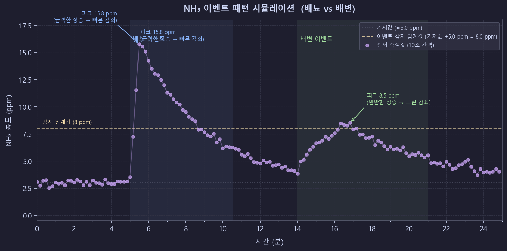

# LitterBox.v1 개발 계획 (Claude Code Plan Mode)

## 프로젝트 정보

- **제조사**: Reasty / **모델**: LitterBox.v1
- **MCU**: Seeed XIAO ESP32-C6
- **통신**: Zigbee 3.0 → SmartThings Hub
- **센서**: MQ-135 (암모니아 NH₃ 감지)
- **프레임워크**: ESP-IDF v5.5.2 + esp-zigbee-sdk
- **개발 OS**: Windows 11 / **IDE**: VS Code

## 전략 원칙

> **"동작하는 것부터 확인, 한 단계씩 수정"**
>
> 공식 예제 → Zigbee 통신 검증 → 표준 센서 클러스터 검증 → 커스텀 센서 통합 → 이벤트 감지 로직

각 Phase는 **독립적으로 빌드/플래시/검증**이 가능해야 합니다.  
이전 Phase가 완전히 검증되기 전에 다음 Phase로 넘어가지 않습니다.

---

## 전체 Phase 개요

```
Phase 1: 개발환경 구축 & 공식 샘플 실행          ✅ 완료
    └─ HA_on_off_light 예제 → SmartThings 페어링 확인

Phase 2: Zigbee 통신 파이프라인 검증 (표준 클러스터) ✅ 완료
    └─ Temperature 클러스터(0x0402) → SmartThings 앱 표시 확인

Phase 3: 센서 데이터 SmartThings 연동 (CO₂ 클러스터 매핑) ✅ 완료
    └─ 더미 NH₃값 → CO₂ Cluster(0x040D) → SmartThings 앱 표시 확인

Phase 4: 커스텀 NH₃ Zigbee 클러스터 검증         ✅ 완료
    └─ 제조사 특화 클러스터(0xFC00) → Edge Driver v12 → SmartThings 실시간 모니터링

Phase 5: MQ-135 실제 센서 통합                    ✅ 완료
    └─ ADC Oneshot API → MQ-135 NH₃ ppm → Zigbee 전송 → SmartThings 실시간 표시

Phase 6: 배뇨/배변 이벤트 감지 로직              ✅ 완료
    └─ 3-state 상태 머신(IDLE→ACTIVE→COOLDOWN) → 배뇨/배변 분류 → SmartThings 알림

Phase 6.5: 커스텀 SmartThings Capability          ✅ 완료
    └─ streetsmile37673.nh3measurement / .toiletevent → Edge Driver v20

Phase 7: 이벤트 감지 튜닝 & 마무리               ← 현재
    ├─ [7.1 ✅] ADC 샘플링 2초로 단축 (2026-02-24)
    ├─ [7.2 🔲] 트리거 임계값 튜닝 (실데이터 수집 후)
    └─ [7.x 🔲] LED 상태 표시, 전력 관리, 안정성 강화
```

---

## Phase 1: 개발환경 구축 & 공식 샘플 실행

**목표**: 공식 HA_on_off_light 예제를 수정 없이 빌드하고, SmartThings Hub와 Zigbee 페어링 확인

### 1-1. 개발환경 확인

- [ ] ESP-IDF v5.5.2 환경 활성화 확인
  ```powershell
  # Windows PowerShell에서 실행
  C:\Espressif\frameworks\esp-idf-v5.5.2\export.ps1
  idf.py --version  # 5.5.2 확인
  ```
- [ ] esp-zigbee-sdk 예제 클론
  ```powershell
  git clone https://github.com/espressif/esp-zigbee-sdk.git
  cd esp-zigbee-sdk/examples/esp_zigbee_HA_sample/HA_on_off_light
  ```

### 1-2. 공식 샘플 빌드 & 플래시

- [ ] 빌드 타겟 설정
  ```powershell
  idf.py set-target esp32c6
  idf.py build
  ```
- [ ] 플래시 (COM 포트 확인 후)
  ```powershell
  idf.py -p COM3 flash monitor
  ```
- [ ] 시리얼 로그에서 Zigbee 초기화 메시지 확인
  ```
  I (xxx) ESP_ZB_ON_OFF_LIGHT: Start network steering
  ```

### 1-3. SmartThings 페어링 확인

- [ ] SmartThings 앱 → 디바이스 추가 → Zigbee 스캔
- [ ] Hub 근처에서 ESP32-C6 리셋 (페어링 모드 진입)
- [ ] SmartThings 앱에 디바이스 등록 확인
- [ ] 앱에서 On/Off 명령 → ESP32 내장 LED 응답 확인

**✅ Phase 1 완료 조건**: SmartThings 앱에서 On/Off 제어가 ESP32 LED에 반영됨

---

## Phase 2: Zigbee 통신 파이프라인 검증

**목표**: NH₃와 무관한 **표준 Temperature 클러스터(0x0402)**로 SmartThings Cloud까지 데이터가 전달되는지 검증.  
커스텀 속성 없이 ZCL 표준만 사용하여 통신 파이프라인 자체를 먼저 신뢰

> **왜 Temperature 클러스터?**  
> SmartThings가 공식 지원하는 가장 단순한 센서 클러스터. 실제 온도센서 없이 더미값으로도 검증 가능.

### 2-1. 프로젝트 초기화

- [ ] Phase 1 샘플을 프로젝트 폴더로 복사
  ```
  project/
  ├── main/
  │   ├── main.c          ← esp_zb_light.c 기반으로 수정
  │   ├── main.h          ← esp_zb_light.h 기반으로 수정
  │   └── CMakeLists.txt
  ├── CMakeLists.txt
  └── sdkconfig
  ```
- [ ] `idf_component.yml`에 esp-zigbee-lib 의존성 추가 확인
  ```yaml
  dependencies:
    espressif__esp-zigbee-lib:
      version: "*"
  ```

### 2-2. 디바이스 정보 수정

`main.c`에서 아래 항목 변경:

- [ ] 제조사명: `"Reasty"`
- [ ] 모델명: `"LitterBox.v1"`
- [ ] 디바이스 타입: `ESP_ZB_HA_TEMPERATURE_SENSOR_DEVICE_ID` (0x0302)
- [ ] Endpoint에 Temperature Measurement Cluster (0x0402) 추가

```c
// Endpoint 구성 예시
esp_zb_ep_list_t *esp_zb_ep_list = esp_zb_ep_list_create();
esp_zb_endpoint_config_t endpoint_config = {
    .endpoint = 1,
    .app_profile_id = ESP_ZB_AF_HA_PROFILE_ID,
    .app_device_id = ESP_ZB_HA_TEMPERATURE_SENSOR_DEVICE_ID,
    .app_device_version = 0
};

// Temperature Measurement Cluster 추가
esp_zb_cluster_list_t *cluster_list = esp_zb_zcl_cluster_list_create();
esp_zb_attribute_list_t *temp_cluster =
    esp_zb_temperature_meas_cluster_create(NULL);
esp_zb_cluster_list_add_temperature_meas_cluster(
    cluster_list, temp_cluster, ESP_ZB_ZCL_CLUSTER_SERVER_ROLE
);
```

### 2-3. 더미 온도값 주기적 전송

- [ ] 10초마다 더미 온도값(2500 = 25.00°C) 전송하는 타이머 구현
  ```c
  // Temperature Cluster MeasuredValue: int16, 단위 0.01°C
  // 2500 = 25.00°C
  int16_t temp_value = 2500;
  esp_zb_zcl_set_attribute_val(
      1,                          // endpoint
      ESP_ZB_ZCL_CLUSTER_ID_TEMP_MEASUREMENT,  // 0x0402
      ESP_ZB_ZCL_CLUSTER_SERVER_ROLE,
      ESP_ZB_ZCL_ATTR_TEMP_MEASUREMENT_VALUE_ID,  // 0x0000
      &temp_value,
      false
  );
  ```

### 2-4. SmartThings Edge Driver 확인

- [ ] SmartThings Hub가 Temperature Sensor로 자동 인식하는지 확인
  - 표준 클러스터이므로 별도 Edge Driver 없이 인식되어야 함
- [ ] SmartThings 앱에서 온도 값(25°C) 표시 확인
- [ ] SmartThings CLI로 실시간 로그 확인
  ```powershell
  smartthings edge:drivers:logcat
  ```

**✅ Phase 2 완료 조건**: SmartThings 앱에서 더미 온도값(25°C)이 정상 표시됨

---

## Phase 3: NH₃ 센서 데이터 SmartThings 연동

**목표**: 실제 센서 없이 **더미 NH₃ ppm값**을 CO₂ Cluster(0x040D)에 매핑하여 SmartThings 앱까지 표시 확인

> **왜 CO₂ 클러스터?**  
> ZCL에 NH₃ 전용 클러스터가 없음. CO₂(0x040D)가 `carbonDioxideMeasurement` capability에 매핑되며,  
> SmartThings가 공식 지원하는 가스 농도 클러스터 중 가장 안정적.

### 3-1. CO₂ 클러스터 추가

> **단위 변환 주의**: ZCL CO₂ cluster는 `Single Precision Float` (0x39), **값 범위 0.0~1.0** (분율)  
> SmartThings Capability는 `integer ppm`으로 표시

```c
// NH₃ ppm → ZCL float 변환 공식
// ZCL_value = ppm / 1,000,000
// 예: 50 ppm → 0.00005f

float nh3_zcl_value = nh3_ppm / 1000000.0f;

esp_zb_zcl_set_attribute_val(
    1,              // endpoint
    0x040D,         // CO₂ Concentration Measurement Cluster
    ESP_ZB_ZCL_CLUSTER_SERVER_ROLE,
    0x0000,         // MeasuredValue attribute
    &nh3_zcl_value,
    false
);
```

- [ ] Endpoint에 CO₂ Cluster (0x040D) 추가
- [ ] 더미값 (50.0f ppm → 0.00005f) 10초마다 전송 구현
- [ ] 빌드 & 플래시

### 3-2. SmartThings Edge Driver 작성

CO₂ 클러스터를 `carbonDioxideMeasurement` capability로 변환하는 Edge Driver 작성.

**Edge Driver 파일 구조**:

```
litterbox-driver/
├── src/
│   └── init.lua
├── profiles/
│   └── litterbox.yaml
├── fingerprints.yaml
└── config.yaml
```

**`profiles/litterbox.yaml`**:

```yaml
name: litterbox-v1
components:
  - id: main
    capabilities:
      - id: carbonDioxideMeasurement
        version: 1
    categories:
      - name: AirQualitySensor
```

**`fingerprints.yaml`**:

```yaml
zigbeeManufacturer:
  - id: "Reasty/LitterBox.v1"
    manufacturer: "Reasty"
    model: "LitterBox.v1"
    deviceProfileName: litterbox-v1
```

**`src/init.lua`**:

```lua
local ZigbeeDriver = require "st.zigbee"
local capabilities = require "st.capabilities"
local zcl_clusters = require "st.zigbee.zcl.clusters"
local data_types = require "st.zigbee.data_types"

-- CO₂ Cluster (0x040D) MeasuredValue → carbonDioxideMeasurement capability 변환
local function co2_attr_handler(driver, device, value, zb_rx)
    -- ZCL: float 0.0~1.0 (분율) → SmartThings: integer ppm
    local ppm = math.floor(value.value * 1000000)
    device:emit_event(
        capabilities.carbonDioxideMeasurement.carbonDioxide(ppm)
    )
end

local litterbox_driver = {
    supported_capabilities = {
        capabilities.carbonDioxideMeasurement,
    },
    zigbee_handlers = {
        attr = {
            [0x040D] = {
                [0x0000] = co2_attr_handler
            }
        }
    },
    cluster_configurations = {
        [capabilities.carbonDioxideMeasurement.ID] = {
            {
                cluster = 0x040D,
                attribute = 0x0000,
                minimum_interval = 5,
                maximum_interval = 60,
                data_type = data_types.SinglePrecisionFloat,
                reportable_change = 0.000001  -- 1 ppm 변화
            }
        }
    }
}

local driver = ZigbeeDriver("litterbox-driver", litterbox_driver)
driver:run()
```

- [ ] Edge Driver 파일 작성 완료
- [ ] SmartThings CLI로 Hub에 업로드
  ```powershell
  smartthings edge:drivers:package litterbox-driver/
  smartthings edge:drivers:install
  ```
- [ ] SmartThings 앱에서 CO₂ 값(50 ppm) 표시 확인

**✅ Phase 3 완료 조건**: SmartThings 앱에서 더미 NH₃ 값이 CO₂ ppm으로 정상 표시됨

---

## Phase 4: 커스텀 NH₃ Zigbee 클러스터 검증

**목표**: CO₂ 클러스터(0x040D) 워크어라운드를 제거하고, 제조사 특화 NH₃ 전용 커스텀 Zigbee 클러스터(0xFC00)를 사용하여 SmartThings까지 end-to-end 데이터 전달 검증

> **왜 이 단계가 필요한가?**
> - CO₂ 클러스터(0x040D)는 NH₃ 데이터를 표현하기 위한 임시 방편 (의미적으로 부정확)
> - ZCL 표준에 NH₃ 전용 클러스터가 없으므로, 제조사 특화 클러스터로 올바르게 정의
> - 실제 센서 통합(Phase 5) 전에 커스텀 클러스터 통신이 동작하는지 먼저 검증
> - float fraction(0.0~1.0) → uint16 ppm 직접 표현으로 단위 변환 단순화

### 4-1. 커스텀 NH₃ 클러스터 설계

| 항목 | 값 |
|------|-----|
| Cluster ID | `0xFC00` (Manufacturer-Specific range) |
| Attribute 0x0000 | NH₃ Measured Value (uint16, ppm) |
| Attribute 0x0001 | Min Measured Value (uint16, ppm, 기본값 0) |
| Attribute 0x0002 | Max Measured Value (uint16, ppm, 기본값 1000) |

> ZCL 표준 Concentration Measurement 클러스터(0x040C~0x042B)와 동일한 attribute 구조를 따르되,
> float fraction 대신 uint16 ppm을 직접 사용하여 단순화.

### 4-2. 펌웨어 수정 (main.h, main.c)

- [x] `main.h`에 커스텀 클러스터 상수 추가 (`NH3_CUSTOM_CLUSTER_ID=0xFC00`, uint16 ppm)
- [x] CO₂ 클러스터(0x040D) 제거 → 커스텀 NH₃ 클러스터(0xFC00) 추가
  - `esp_zb_custom_cluster_add_custom_attr()` + `esp_zb_cluster_list_add_custom_cluster()` 사용
- [x] 타이머 콜백에서 uint16 ppm 직접 전송 (`esp_zb_zcl_report_attr_cmd_req()` 수동 호출)
- [x] **`esp_zb_zcl_update_reporting_info()` 제거** (커스텀 클러스터에 사용 시 crash 발생)
- [x] 빌드 & 플래시 완료
- [x] 시리얼 로그 확인: `Reported NH3=50 ppm (custom cluster 0xFC00)` 출력

> **⚠️ 주의**: `esp_zb_zcl_update_reporting_info()`를 커스텀 클러스터(0xFC00~0xFFFF)에 사용하면
> `zcl_general_commands.c:612`에서 assertion crash 발생. 커스텀 클러스터는 반드시 수동 타이머 방식 사용.

> **⚠️ 주의**: 클러스터 ID 변경(0x040D→0xFC00) 후 **Zigbee NVS 반드시 초기화** 필요.
> 이전 reporting config가 NVS에 남아 재부팅 시 crash 유발.
> ```powershell
> & $esptool --port COM3 --baud 460800 erase_region 0xF1000 0x5000
> ```

### 4-3. SmartThings Edge Driver 수정 (v12)

- [x] `config.yaml`: `packageKey` → `litterbox-driver-v12`
- [x] `profiles/litterbox-v1.yaml`: `carbonDioxideMeasurement` → `tvocMeasurement`
  - NH₃는 기술적으로 VOC가 아니지만, `tvocMeasurement`가 `carbonDioxideMeasurement`보다 의미적으로 더 적합
  - 두 capability 모두 1h/24h/31d 그래프 지원
- [x] `src/init.lua`: `zigbee_handlers.attr[0xFC00][0x0000]` 핸들러, `tvocMeasurement.tvocLevel()` emit
- [x] 새 드라이버(v12) 패키징 & 허브 배포 완료

### 4-4. 검증

- [x] Edge Driver logcat에서 0xFC00 클러스터 수신 확인
  ```
  INFO litterbox-driver-v12  NH3: 50 ppm (cluster 0xFC00)
  INFO litterbox-driver-v12  emitting event: tvocLevel value=50 unit=ppm
  ```
- [x] SmartThings 앱에서 NH₃ 50 ppm 실시간 표시 (10초 간격) 확인
- [x] tvocMeasurement 그래프 뷰 (1h/24h/31d) 지원 확인
- [x] 재부팅 후 자동 재연결 및 데이터 송신 확인

**✅ Phase 4 완료 조건**: 커스텀 클러스터(0xFC00)로 전송한 NH₃ ppm 값이 SmartThings 앱에서 실시간으로 표시됨

---

## Phase 5: MQ-135 실제 센서 통합

**목표**: MQ-135 센서를 ADC로 읽어 실제 NH₃ ppm 값을 Zigbee로 전송

### 5-1. 파일 구조 확장

```
project/
├── main/
│   ├── main.c
│   ├── main.h
│   ├── light_driver_internal.c   ← LED 상태 표시용 유지
│   ├── light_driver.h
│   ├── air_sensor_driver_MQ135.c ← 신규: MQ-135 ADC 드라이버
│   ├── air_sensor_driver.h       ← 신규: 센서 추상화 헤더
│   └── CMakeLists.txt
```

### 5-2. 센서 추상화 헤더 (`air_sensor_driver.h`)

```c
#pragma once
#include <stdint.h>
#include <stdbool.h>

// 센서 데이터 구조체 (센서 교체해도 이 인터페이스는 유지)
typedef struct {
    float nh3_ppm;          // 암모니아 농도 (ppm)
    uint32_t raw_adc;       // ADC 원시값 (디버깅용)
    bool is_valid;          // 센서 읽기 성공 여부
} air_sensor_data_t;

// 공개 인터페이스
esp_err_t air_sensor_init(void);
esp_err_t air_sensor_read(air_sensor_data_t *data);
```

### 5-3. MQ-135 드라이버 (`air_sensor_driver_MQ135.c`)

- [x] ADC1 초기화 (Oneshot API, ESP-IDF v5.5.2)

  ```c
  // 참고: https://docs.espressif.com/projects/esp-idf/en/v5.5.2/esp32c6/api-reference/peripherals/adc_oneshot.html
  adc_oneshot_unit_handle_t adc_handle;
  adc_oneshot_unit_init_cfg_t init_config = {
      .unit_id = ADC_UNIT_1,
  };
  adc_oneshot_new_unit(&init_config, &adc_handle);

  adc_oneshot_chan_cfg_t config = {
      .bitwidth = ADC_BITWIDTH_12,
      .atten = ADC_ATTEN_DB_12,  // 0~3.3V 범위
  };
  adc_oneshot_config_channel(adc_handle, ADC_CHANNEL_0, &config);
  ```

- [x] ADC 값 → ppm 변환 함수 구현 (MQ-135 감도 곡선 기반)
  ```c
  // MQ-135 NH₃ 감도 곡선 근사 (캘리브레이션 필요)
  // Rs/Ro 비율 → ppm 변환
  static float adc_to_nh3_ppm(uint32_t adc_raw) {
      float voltage = (adc_raw / 4095.0f) * 3.3f;
      float rs = ((3.3f - voltage) / voltage) * 10.0f; // RL=10kΩ
      float ratio = rs / R0_NH3;  // R0: 깨끗한 공기에서의 저항값
      // NH₃ 감도 곡선: ppm = a * (Rs/Ro)^b
      return 102.2f * powf(ratio, -2.473f);
  }
  ```
- [x] 웜업 대기 시간 처리 (MQ-135: 최소 20초)
- [x] `air_sensor_read()` 함수 완성

### 5-4. 센서 데이터 Zigbee 전송 통합

- [x] `main.c`에서 10초 타이머로 `air_sensor_read()` 호출
- [x] 읽은 NH₃ ppm을 커스텀 NH₃ Cluster(0xFC00)로 전송 (Phase 4에서 구축된 파이프라인 활용)
- [x] 시리얼 로그로 ppm 값 확인
- [x] SmartThings 앱에서 실시간 값 변화 확인

### 5-5. MQ-135 캘리브레이션

- [ ] 신선한 공기에서 R0 측정 (20분 이상 안정화 후) ← 실환경 테스트 필요
- [ ] `R0_NH3` 상수 코드에 적용
- [ ] 암모니아 발생 환경(화장실 근처)에서 값 변화 확인

**✅ Phase 5 완료 조건**: MQ-135로 읽은 실제 NH₃ 값이 SmartThings 앱에서 10초 간격으로 업데이트됨

---

## Phase 6: 배뇨/배변 이벤트 감지 로직

**목표**: NH₃ 농도 패턴으로 배뇨/배변을 구분하여 SmartThings 알림 전송

### 6-1. 감지 알고리즘 설계

| 이벤트 | NH₃ 패턴 | 상승 속도 | 지속 시간 |
|--------|----------|----------|----------|
| 배뇨 | 급격한 스파이크 후 빠른 감쇠 | 30초 내 +10 ppm↑ | 5~10분 |
| 배변 | 완만한 상승 후 느린 감쇠 | 2~3분에 걸쳐 +3~5 ppm↑ | 10~20분 |



> 위 그래프는 10초 샘플링 간격(펌웨어와 동일)으로 시뮬레이션한 예상 패턴.
> 실제 값은 환경(환기, 모래 종류, 덮개 유무)에 따라 달라짐.

### 6-2. 이벤트 감지 파일 추가

```
project/
├── main/
│   ├── ...
│   ├── event_detector.c   ← 신규: 이벤트 감지 로직
│   └── event_detector.h
```

- [x] `event_detector.h` — 이벤트 타입 정의

  ```c
  typedef enum {
      EVENT_NONE      = 0,
      EVENT_URINATION = 1,   // 배뇨
      EVENT_DEFECATION = 2,  // 배변
  } litter_event_t;

  typedef struct {
      float baseline_ppm;     // 기저 NH₃ 농도
      float current_ppm;      // 현재 NH₃ 농도
      float peak_ppm;         // 이벤트 중 최고 농도
      uint32_t event_start_ms;
      litter_event_t last_event;
  } event_context_t;

  litter_event_t event_detector_update(event_context_t *ctx, float new_ppm);
  ```

- [x] `event_detector.c` — 3-state 상태 머신 구현 (IDLE/ACTIVE/COOLDOWN)
  - EMA 기저선 추적 (α=0.05, ~200초 시정수)
  - 배뇨: peak_ticks ≤ 3 또는 peak_delta > 30 ppm
  - 배변: 완만한 상승 (peak_ticks > 3)
- [x] 이벤트 발생 시 NH₃ 클러스터 attr 0x0003(uint8)으로 전송

### 6-3. SmartThings 알림 연동

- [x] Edge Driver attr 0x0003 핸들러 추가 → `streetsmile37673.toiletevent` emit
- [x] SmartThings 앱에서 "소변 감지됨" / "대변 감지됨" 표시 확인

**✅ Phase 6 완료 조건**: 실제 화장실 사용 시 배뇨/배변 이벤트가 SmartThings 앱 알림으로 수신됨

---

## Phase 6.5: 커스텀 SmartThings Capability

**목표**: 빌트인 capability(tvocMeasurement, carbonMonoxideDetector)를 제품 전용 커스텀 capability로 교체하여 앱 표시 정보를 정확하게 표현

### 구현 내용

- [x] `streetsmile37673.nh3measurement` — NH₃ 농도 (number, 0~1000 ppm)
  - 슬라이더 UI, 한/영 번역, NH₃ 유니코드 첨자(₃) 적용
- [x] `streetsmile37673.toiletevent` — 화장실 사용 이벤트 (enum: none/urination/defecation)
  - 번역: 감지 안 됨 / 소변 감지됨 / 대변 감지됨
- [x] Edge Driver v20: 두 커스텀 capability + switch
- [x] 제품 리브랜딩: 고양이 전용 → 반려동물 범용 ("Smart Pet Toilet Monitor")

**✅ Phase 6.5 완료 조건**: SmartThings 앱에서 "암모니아(NH₃)" / "배변 감지" 표시 확인

---

## Phase 7: 이벤트 감지 튜닝 & 마무리

**목표**: 실제 환경 테스트로 이벤트 감지 파라미터를 최적화하고, 코드 품질 및 안정성 강화

### 7-1. ADC 샘플링 주기 단축 ✅ (2026-02-24)

**실제 소변 테스트 결과 (2026-02-24)**:
- 환경: 밀폐형 화장실, 센서 모래 1cm 앞
- baseline ~4.6 ppm, 소변 후 최대 6.3 ppm (delta +1.6 ppm)
- 트리거 임계값 10 ppm → **미감지**
- 원인: 응고 모래가 NH₃를 빠르게 흡착 + 10초 샘플링이 짧은 스파이크를 놓침

**적용된 수정 (`main.h`, `main.c`)**:
- `SENSOR_SAMPLE_INTERVAL_MS = 2000` (ADC 읽기 + 이벤트 감지)
- `SENSOR_REPORT_INTERVAL_MS = 10000` (Zigbee 보고, 5틱마다)
- `SENSOR_REPORT_TICKS = 5`
- `sensor_report_timer_cb` → `sensor_sample_timer_cb` (tick 카운터)

### 7-2. 트리거 임계값 튜닝 (예정)

- [ ] 2초 샘플링으로 실제 소변 이벤트 데이터 재수집
- [ ] 관측된 delta 값에 따라 `EVENT_TRIGGER_DELTA_PPM` 조정 (현재 10.0)
- [ ] 필요 시 `EVENT_HYSTERESIS_PPM` 도 조정

### 7-3. LED 상태 표시 정리

- [ ] 이벤트 감지 시 LED 패턴으로 상태 표시
  - 대기 중: LED OFF
  - 이벤트 감지 중: LED 느리게 점멸
  - 배뇨 감지: LED 빠르게 점멸 후 OFF

### 7-4. 코드 정리

- [ ] 미사용 코드 제거 (HA_on_off_light 잔재)
- [ ] 상수값 헤더로 분리 (`config.h`)
  ```c
  #define SENSOR_READ_INTERVAL_MS    10000   // 10초
  #define NH3_BASELINE_WARMUP_SEC    60      // 기저값 측정 대기
  #define NH3_URINATION_THRESHOLD    20.0f   // 배뇨 판정 기준 (ppm 상승량)
  #define MQ135_R0_NH3               10.0f   // 캘리브레이션값
  ```
- [ ] 주요 함수 Doxygen 스타일 주석 추가

### 7-5. 안정성 강화

- [ ] Zigbee 재연결 처리 (허브 재시작 시 자동 재페어링)
- [ ] 센서 읽기 실패 시 재시도 로직
- [ ] WDT(Watchdog) 설정

### 7-6. CLAUDE.md 최종 업데이트

- [ ] 완성된 파일 구조 반영
- [ ] 캘리브레이션 값 기록
- [ ] 알려진 이슈 및 해결 방법 기록

**✅ Phase 7 완료 조건**: 48시간 연속 동작 안정성 확인

---

## 참고: 공통 개발 워크플로우

### 빌드 & 플래시 (매 Phase 공통)

```powershell
# 1. ESP-IDF 환경 활성화
C:\Espressif\frameworks\esp-idf-v5.5.2\export.ps1

# 2. 클린 빌드 (헤더 에러 발생 시)
Remove-Item -Recurse -Force build, managed_components
idf.py build

# 3. 플래시 & 모니터
idf.py -p COM3 flash monitor
```

### SmartThings Edge Driver 배포

```powershell
# Edge Driver 패키징 & 배포
smartthings edge:drivers:package ./litterbox-driver
smartthings edge:drivers:install --hub <HUB_ID>

# 실시간 로그 확인
smartthings edge:drivers:logcat --hub <HUB_ID>
```

### 핵심 ZCL 단위 변환 공식

```
[현재 방식 - Phase 4 완료]
NH₃ Custom Cluster (0xFC00): uint16 = ppm (직접)  (50 ppm → 50)

[Zigbee → SmartThings Capability]
tvocMeasurement.tvocLevel: ppm = uint16 (변환 불필요)
```

---

## 참고 문서

| 문서                                   | URL                                                                                                      |
| -------------------------------------- | -------------------------------------------------------------------------------------------------------- |
| ESP-IDF v5.5.2                         | https://docs.espressif.com/projects/esp-idf/en/v5.5.2/                                                   |
| ESP Zigbee SDK                         | https://github.com/espressif/esp-zigbee-sdk                                                              |
| Zigbee Programming Guide               | https://docs.espressif.com/projects/esp-zigbee-sdk/en/latest/esp32c6/                                    |
| HA_on_off_light 예제                   | https://github.com/espressif/esp-zigbee-sdk/tree/main/examples/esp_zigbee_HA_sample/HA_on_off_light      |
| ADC Oneshot API                        | https://docs.espressif.com/projects/esp-idf/en/v5.5.2/esp32c6/api-reference/peripherals/adc_oneshot.html |
| SmartThings Edge Driver 문서           | https://developer.smartthings.com/docs/edge-device-drivers/zigbee/                                       |
| SmartThings Capability Reference       | https://smartthings.developer.samsung.com/develop/api-ref/capabilities.html                              |
| SmartThings Edge Drivers (공식 GitHub) | https://github.com/SmartThingsCommunity/SmartThingsEdgeDrivers                                           |

---

_작성일: 2026-02-18_
_최종 업데이트: 2026-02-24 (Phase 7.1 완료 — ADC 샘플링 2초로 단축)_
_버전: v1.4_
