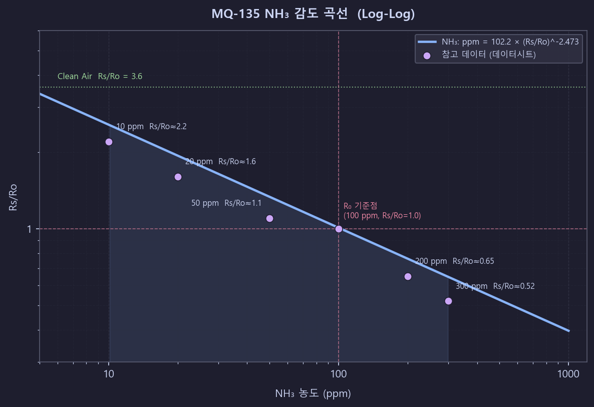
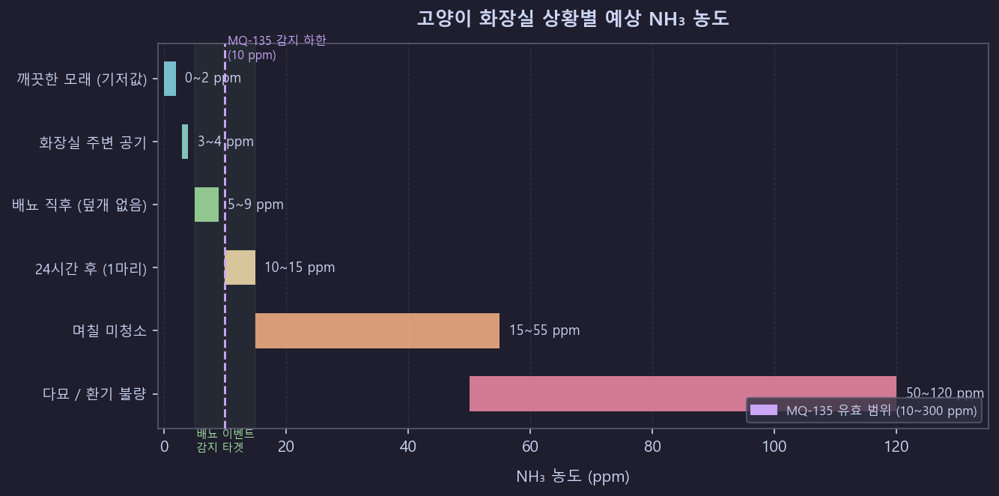

# Sensor Reference - LitterBox.v1

## MQ-135 Gas Sensor

### 개요

MQ-135는 Hanwei/Winsen에서 제조하는 반도체 금속산화물(SnO₂) 가스 센서.
내부 히터가 SnO₂ 감지층을 200~300°C로 가열하면, 환원성 가스(NH₃ 등) 농도에 따라
전기 저항이 **감소**하는 원리로 동작한다.

**감지 가능 가스**: NH₃, CO₂, NOx, 알코올, 벤젠, 톨루엔, 아세톤, 연기
**이 프로젝트 타겟**: NH₃ (암모니아) — 반려동물 소변에서 발생

### 핀 구성 (모듈 보드 기준)

| 핀  | 이름 | 설명                                               |
| --- | ---- | -------------------------------------------------- |
| 1   | VCC  | +5V 전원                                           |
| 2   | GND  | 접지                                               |
| 3   | DO   | 디지털 출력 (온보드 가변저항 임계값, LM393 비교기) |
| 4   | AO   | 아날로그 출력 (0~5V, 가스 농도에 비례)             |

### 전기적 사양

| 파라미터           | 값           | 비고                                      |
| ------------------ | ------------ | ----------------------------------------- |
| 히터 전압 (VH)     | 5.0V ±0.1V   | AC 또는 DC                                |
| 회로 전압 (VC)     | 5.0V ±0.1V   | DC                                        |
| 히터 저항 (RH)     | 31Ω ±3Ω      | 제조사별 상이 (33Ω ±5% 변종 있음)         |
| 히터 소비전력 (PH) | ≤ 800mW      | 약 150~170mA @ 5V                         |
| 부하 저항 (RL)     | 10kΩ ~ 47kΩ  | 데이터시트 권장: 20kΩ. **모듈 실측 필수** |
| 감지 저항 (Rs)     | 30kΩ ~ 200kΩ | @ 100ppm NH₃, 표준 시험 조건              |

> **주의**: 히터는 200mA 이상 필요 → ESP32-C6 GPIO로 구동 불가, 반드시 5V 전원 레일에서 공급

### 동작 조건

| 파라미터       | 값                               |
| -------------- | -------------------------------- |
| 동작 온도      | -10°C ~ +45°C                    |
| 동작 습도      | < 95% RH (비응결)                |
| 표준 시험 조건 | 20°C ±2°C, 65% ±5% RH, RL = 20kΩ |
| O₂ 농도        | 21% (대기 표준)                  |

### 예열 시간

| 조건                     | 예열 시간                         |
| ------------------------ | --------------------------------- |
| 최초 사용 (첫 전원 인가) | **24시간 이상** 연속 가열         |
| 이후 전원 재투입         | 3~5분 (안정적), 60~120초 (대략적) |
| 최소 동작                | 20초                              |

> 리터박스 모니터는 **히터를 항상 켜둔 상태**로 운용하는 것이 정확도에 유리.

---

### 감도 곡선 (NH₃)

#### 멱함수(Power Law) 모델

Rs/Ro와 가스 농도(ppm)의 관계는 log-log 스케일에서 선형:

```
ppm = a × (Rs/Ro)^b
```

#### NH₃ 계수

| 출처                      | a        | b       |
| ------------------------- | -------- | ------- |
| MQSensorsLib (miguel5612) | 102.2    | -2.473  |
| AmanSCoder/MQ135          | 101.3708 | -2.5082 |

**채택값**:

```c
#define MQ135_NH3_COEFF_A    102.2f
#define MQ135_NH3_COEFF_B    -2.473f
```

#### 참고: 다른 가스 계수 (MQSensorsLib)

| 가스    | a         | b          |
| ------- | --------- | ---------- |
| CO      | 605.18    | -3.937     |
| 알코올  | 77.255    | -3.18      |
| CO₂     | 110.47    | -2.862     |
| 톨루엔  | 44.947    | -3.445     |
| **NH₃** | **102.2** | **-2.473** |
| 아세톤  | 34.668    | -3.369     |

#### NH₃ Rs/Ro → ppm 참고 테이블

| NH₃ ppm | Rs/Ro (근사)        |
| ------- | ------------------- |
| 10      | ~2.20               |
| 20      | ~1.60               |
| 50      | ~1.10               |
| 100     | ~1.00 (교정 기준점) |
| 200     | ~0.65               |
| 300     | ~0.52               |

#### Clean Air Ratio

```
Rs/Ro (깨끗한 공기) = 3.6
```

이 상수는 R0 교정에 사용됨.

#### 감도 곡선 그래프 (Log-Log)

`ppm = a × (Rs/Ro)^b` 관계를 시각화한 그래프 (로그-로그 스케일):



> **기울기**: 로그-로그 평면에서 직선 (멱함수, `b ≈ -2.47`)
> **★ R₀ 기준점**: 100 ppm NH₃에서 Rs/Ro = 1.0 (교정 앵커)
> **유효 범위**: 10~300 ppm

### NH₃ 감지 범위

- **유효 범위**: 10 ~ 300 ppm
- **정확도 최적 범위**: 10 ~ 200 ppm
- 10 ppm 미만에서는 곡선이 평탄해져 분해능이 급격히 떨어짐

---

### Rs 계산 (ADC 값 → 저항)

센서와 부하 저항(RL)이 전압 분배기를 구성:

```
    VCC (5V)
      |
     [Rs]   ← 센서 저항 (가변)
      |
      +---→ Vout (AO 핀)
      |
     [RL]   ← 부하 저항 (고정, 예: 20kΩ)
      |
     GND
```

```
Vout = VCC × RL / (Rs + RL)
Rs = RL × (VCC - Vout) / Vout
Rs = RL × ((VCC / Vout) - 1)
```

### ESP32-C6 ADC 인터페이스 (XIAO ESP32-C6)

#### ADC 사양

| 항목     | 값                                     |
| -------- | -------------------------------------- |
| 해상도   | 12비트 (0~4095)                        |
| ADC 유닛 | ADC1 (ESP32-C6에는 ADC1만 사용 가능)   |
| 감쇄     | `ADC_ATTEN_DB_12` → 최대 약 **3100mV** |
| API      | ADC Oneshot (ESP-IDF v5.5.2)           |

#### XIAO ESP32-C6 ADC 핀 매핑

> XIAO 보드의 실크 라벨 기준. 공식 핀 리스트 이미지(Seeed Studio Wiki) 확인 완료.

| XIAO 보드 핀 | 칩 GPIO   | ADC 채널                 |
| ------------ | --------- | ------------------------ |
| **A0**       | **GPIO0** | **ADC1_CH0** ← 현재 사용 |
| A1           | GPIO1     | ADC1_CH1                 |
| A2           | GPIO2     | ADC1_CH2                 |

**핀아웃 참고 이미지**: [Seeed Studio XIAO ESP32-C6 Getting Started](https://wiki.seeedstudio.com/xiao_esp32c6_getting_started/) — Hardware overview 섹션 "XIAO ESP32C6 Pin List" 이미지

---

## 하드웨어 연결 (초보자 가이드)

> **전자공학 지식이 없어도 따라할 수 있는 단계별 연결 방법**

### 필요 부품

- Seeed XIAO ESP32-C6 보드
- MQ-135 모듈 (breakout board, 4핀 버전)
- 점퍼 케이블 (Female-to-Female, 3개)
- USB-C 케이블 (XIAO에 전원 공급)

### MQ-135 모듈 핀 확인

MQ-135 모듈 뒷면 또는 PCB에 아래 4개 핀이 있습니다:

```
┌─────────────────────────┐
│  ●센서 돔●              │
│                         │
│  [VCC] [GND] [DO] [AO]  │
└─────────────────────────┘

VCC : 전원 (+)
GND : 접지 (-)
DO  : 디지털 출력 (이 프로젝트에서는 사용 안 함)
AO  : 아날로그 출력 ← 이것을 ESP32에 연결
```

### 방법 A: 3.3V 직결 ~~(권장)~~ ← **실환경 테스트 결과 감도 부족으로 방법 B로 전환됨**

MQ-135를 **3.3V로 구동**하면 전압 분배기 없이 바로 연결할 수 있습니다.
히터 온도가 낮아 감도가 크게 저하됨. 실제 소변 후 모래 덩어리 테스트에서 2 ppm 이하만 반응하여 이벤트 감지 불가 확인 (2026-02-22).

#### 연결 테이블

| MQ-135 핀 | XIAO ESP32-C6 핀 | 케이블 색 (권장) |
| --------- | ---------------- | ---------------- |
| VCC       | 3V3              | 빨간색           |
| GND       | GND              | 검정색           |
| AO        | A0               | 노란색           |
| DO        | 연결 안 함       | —                |

#### 배선도

```
XIAO ESP32-C6                    MQ-135 모듈
┌─────────────┐                ┌──────────────┐
│             │                │  ┌─────────┐ │
│         3V3 │━━━━━━━━━━━━━━━━│VCC│         │ │
│  (우측 3번) │                │  └─────────┘ │
│         GND │━━━━━━━━━━━━━━━━│GND│         │ │
│  (우측 2번) │                │  └─────────┘ │
│          A0 │━━━━━━━━━━━━━━━━│ AO│         │ │
│  (GPIO0)    │                │  └─────────┘ │
│             │                │           DO │ (연결 안 함)
└─────────────┘                └──────────────┘
```

#### XIAO 보드에서 핀 위치 찾기 (공식 핀 리스트 기준)

```
XIAO ESP32-C6 상단면 (USB-C 포트가 위쪽)

                        USB-C
                         ┌──────┐
                  (좌측)  │      │ (우측)
    LP_GPIO0/GPIO0/A0/D0 ┤●    ●├ 5V
    LP_GPIO1/GPIO1/A1/D1 ┤●    ●├ GND    ← MQ-135 GND 연결
    LP_GPIO2/GPIO2/A2/D2 ┤●    ●├ 3V3    ← MQ-135 VCC 연결
    SDIO_DATA1/GPIO21/D3 ┤●    ●├ D10/MOSI/GPIO18/SDIO_CMD
SDIO_DATA2/GPIO22/SDA/D4 ┤●    ●├ D9/MISO/GPIO20/SDIO_DATA0
SDIO_DATA3/GPIO23/SCL/D5 ┤●    ●├ D8/SCK/GPIO19/SDIO_CLK
            GPIO16/TX/D6 ┤●    ●├ D7/RX/GPIO17
                         └──────┘

A0 (좌측 1번) ← MQ-135 AO 연결 (GPIO0)
```

> ⚠️ **핀 위치 주의**: GND와 3V3은 **우측(USB-C에서 2번째, 3번째)** 핀입니다.
> 좌측에는 GND/3V3이 없습니다.

#### 핀 이름 체계 설명

하나의 물리적 핀에 여러 이름이 붙는 이유는 **핀 멀티플렉싱** 때문입니다.
같은 핀을 어떤 기능으로 사용하느냐에 따라 부르는 이름이 달라집니다.

| 표기 예시 | 이름 체계 | 의미 | 사용 예 |
|-----------|----------|------|--------|
| `A0`, `A1`, `A2` | **아날로그 핀 번호** (보드 라벨) | XIAO PCB에 인쇄된 아날로그 입력용 번호. ADC 가능 핀에만 붙음 | 배선 연결 시 |
| `D0`~`D10` | **디지털 핀 번호** (보드 라벨) | XIAO PCB에 인쇄된 디지털 I/O 번호. Arduino 스타일 | 배선 연결 시 |
| `GPIO0`~`GPIO23` | **GPIO 번호** (칩 레벨) | ESP32-C6 칩이 내부적으로 부르는 번호. ESP-IDF 코드에서 사용 | `gpio_set_level(GPIO_NUM_0, 1)` |
| `LP_GPIO0`~`LP_GPIO2` | **저전력 GPIO** (LP = Low Power) | 딥슬립 중에도 동작 가능한 ULP(Ultra-Low-Power) 전용 핀 | 저전력 웨이크업 감지 |
| `ADC1_CH0`~`ADC1_CH2` | **ADC 채널 번호** | 아날로그→디지털 변환기 내부 채널 번호. ADC API에서 사용 | `ADC_CHANNEL_0` |
| `SDA`, `SCL` | **I2C 버스** | I2C 통신의 데이터(SDA)·클럭(SCL) 신호선 | DHT22, OLED 등 |
| `TX`, `RX` | **UART 시리얼** | 직렬 통신 송신(TX)·수신(RX) | 시리얼 콘솔, GPS 등 |
| `SCK`, `MOSI`, `MISO` | **SPI 버스** | SPI 통신의 클럭·데이터 출력·데이터 입력 | SD카드, 디스플레이 등 |
| `SDIO_*` | **SDIO 버스** | SD카드 / Wi-Fi·BT 내부 버스 (일반 용도로는 사용 안 함) | 내부 전용 |

> **이 프로젝트에서 A0 핀의 역할**: 아날로그 입력(`ADC_CHANNEL_0`)으로 사용.
> 코드에서는 `ADC_CHANNEL_0`으로 참조하고, 배선 설명에서는 `A0`으로 표기합니다.

---

### 방법 B: 5V + 전압 분배기 ✅ **현재 적용 방식**

5V로 구동하면 히터가 설계 전압으로 동작하여 감도가 크게 향상됩니다.
AO 출력이 최대 5V까지 올라갈 수 있으므로 **전압 분배기**가 반드시 필요합니다.

> ESP32-C6 ADC 최대 입력: **3.1V**. 5V를 직접 연결하면 **보드가 손상**됩니다.

#### 전압 분배기 회로

```
MQ-135 AO ─────[R1: 100kΩ]────┬──── XIAO A0 (GPIO0)
                               │
                           [R2: 100kΩ]
                               │
                              GND
```

```
분배 비율 = R2 / (R1 + R2) = 100k / 200k = 0.5
5V × 0.5 = 2.5V  (ADC 범위 3.1V 이내 ✓)
```

#### 왜 100kΩ인가? — 저항값 선정 이유

전압 분배기의 저항값을 결정할 때 세 가지 제약이 동시에 작용한다.

---

##### 제약 1: MQ-135 출력에 대한 부하 영향 (Loading Effect)

MQ-135 모듈 내부에는 이미 **부하 저항(RL ≈ 10kΩ)**이 AO 핀과 GND 사이에 연결되어 있다.

```
MQ-135 내부            외부 분배기
   VCC (5V)
     │
   [Rs]    ← 가변 저항 (가스 농도에 따라 변화)
     │
    AO ────[R1: 100kΩ]────┬──── GPIO0 (ADC)
     │                    │
 [RL: 10kΩ]          [R2: 100kΩ]
     │                    │
    GND                  GND
```

외부 R2도 AO와 GND 사이에 놓이므로 **내부 RL과 외부 R2는 병렬**이 된다.
병렬 합성 저항이 바뀌면 AOUT 전압이 변형되어 Rs 계산(→ ppm)에 오차가 생긴다.

```
RL_eff = (RL × R2) / (RL + R2)
```

| R2 값 | RL_eff | RL 대비 변화 | 영향 |
|--------|--------|------------|------|
| 1kΩ   | 909Ω   | −91% | Rs 계산 완전히 틀어짐 |
| 10kΩ  | 5kΩ    | −50% | 심각한 오차 |
| **100kΩ** | **9.09kΩ** | **−9%** | **허용 범위 (상대 변화 감지 목적)** ✅ |
| 1MΩ   | 9.90kΩ | −1%  | 거의 무시 가능 |

**R2 ≥ 10 × RL** 조건을 지켜야 영향을 10% 이내로 제한할 수 있다.
RL = 10kΩ이므로 **R2 ≥ 100kΩ**가 최소 조건.

---

##### 제약 2: ADC 소스 임피던스 한계

ESP32-C6 ADC 내부에는 샘플링 커패시터(수십 pF)가 있다. ADC가 정확히 읽으려면 샘플링 시간 안에 이 커패시터가 완전히 충전되어야 하는데, 충전 속도는 소스 임피던스에 반비례한다. 소스 임피던스가 너무 높으면 커패시터가 덜 충전된 채로 변환이 완료되어 읽기값이 낮게 나온다.

GPIO0 핀에서 바라본 소스 임피던스:

```
Z_source = R1 ∥ R2 = (R1 × R2) / (R1 + R2)
         = 100kΩ ∥ 100kΩ
         = 50kΩ
```

ESP-IDF 문서 권장 기준: **소스 임피던스 < 100kΩ**
→ 50kΩ는 안전 범위 이내 ✅

1MΩ을 사용하면: Z_source = 500kΩ → ADC 읽기 정밀도 저하.

---

##### 제약 3: 전류 소비

분배기는 전원이 연결된 동안 항상 전류를 소비한다.

```
I = VCC / (R1 + R2) = 5V / 200kΩ = 25μA
```

| R1+R2 합계 | 전류 | 비고 |
|------------|------|------|
| 2kΩ (1kΩ×2) | 2.5mA | MQ-135 히터 전류(~150mA)의 약 1.7% 추가 낭비 |
| **200kΩ (100kΩ×2)** | **25μA** | **무시할 수 있는 수준** ✅ |
| 2MΩ (1MΩ×2) | 2.5μA | 소비는 적지만 임피던스 문제 발생 |

---

##### 100kΩ가 세 가지 제약을 동시에 만족하는 이유

| 제약 | 요구 조건 | 100kΩ 결과 | 판정 |
|------|----------|------------|------|
| Loading effect (R2 ≥ 10×RL) | R2 ≥ 100kΩ | 100kΩ | ✅ 경계값 충족 |
| ADC 소스 임피던스 | R1∥R2 < 100kΩ | **50kΩ** | ✅ 안전 |
| 전류 소비 최소화 | 높을수록 유리 | 25μA | ✅ 무시 가능 |

> 1MΩ으로 올리면 Loading effect는 더 줄지만, ADC 소스 임피던스가 500kΩ으로 높아져 정밀도가 저하된다.
> 100kΩ이 두 조건을 동시에 만족하는 최적 타협점.

---

##### 왜 GND에 연결하는 두 번째 저항(R2)이 반드시 필요한가

R1만 있고 R2가 없는 경우:

```
AO ──[R1: 100kΩ]──── GPIO0 (ADC)
                          │
                        (오픈)   ← 아무것도 없음
```

GPIO0는 ADC 내부 누설 전류로만 전위가 결정되어 **부유(floating) 상태**가 된다.
ADC 읽기값이 불안정하고 노이즈가 심해진다.

R2를 GND에 연결하면:

```
AO ──[R1: 100kΩ]──┬── GPIO0 (ADC)
                   │
              [R2: 100kΩ]    ← R2를 통해 전류가 GND로 흐름
                   │
                  GND
```

R1과 R2가 직렬로 전압을 분배한다:

```
V_GPIO0 = V_AO × R2 / (R1 + R2)
        = V_AO × 100kΩ / 200kΩ
        = V_AO × 0.5         ← 전압이 정확히 절반
```

**R2의 역할 요약:**

| 역할 | 설명 |
|------|------|
| 전압 분배 | VCC와 GND 사이에 전류 경로를 만들어 중간 전압 생성 |
| 안정된 기준점 | GPIO0를 GND에 약하게 연결하여 부유 상태 방지 |
| ESD 보호 보조 | 정전기 발생 시 GND로 방전되는 경로 제공 |

---

#### 연결 테이블 (방법 B)

| MQ-135 핀 | 연결 |
| --------- | ---- |
| VCC       | XIAO **5V (VBUS)** |
| GND       | XIAO GND |
| AO        | 100kΩ → XIAO A0 (GPIO0), 분기점에 100kΩ → GND |

#### 배선도 (방법 B)

```
XIAO ESP32-C6                         MQ-135 모듈
┌─────────────┐                      ┌──────────────┐
│          5V │━━━━━━━━━━━━━━━━━━━━━━│VCC           │
│  (우측 1번) │                      │              │
│         GND │━━━━━━━━━━━━━━━━━━━━━━│GND           │
│          A0 │◀━━[100kΩ]━━┬━━━━━━━━│AO            │
│  (GPIO0)    │            │         └──────────────┘
└─────────────┘         [100kΩ]
                            │
                           GND
```

---

### 현재 구현 기준 (방법 B, 5V + 분배기)

`air_sensor_driver_MQ135.c`의 현재 설정:

```c
#define MQ135_VCC                   5.0f    // VBUS (5V)
#define MQ135_DIVIDER_RATIO         2.0f    // 100kΩ:100kΩ 분배기
#define MQ135_ADC_VREF              3.3f    // ADC 기준 전압
#define MQ135_LOAD_RESISTANCE_KOHM  10.0f   // 모듈 내장 RL
#define MQ135_R0_KOHM               10.0f   // 임시값 — 재캘리브레이션 필요
```

Rs 계산 방식:
```c
float v_adc    = (raw / 4095.0f) * 3.3f;      // ADC가 읽은 전압
float v_aout   = v_adc * 2.0f;                 // 분배기 이전 실제 AOUT
float rs_kohm  = 10.0f * (5.0f - v_aout) / v_aout;
```

---

### 참고 영상 & 이미지 자료

초보자에게 도움이 될 시각 자료:

#### XIAO ESP32-C6 공식 자료

- **핀아웃 이미지**: [Seeed Studio XIAO ESP32-C6 Getting Started](https://wiki.seeedstudio.com/xiao_esp32c6_getting_started/) 페이지 내 "Pinout" 섹션
- **Seeed Studio 공식 YouTube**: "XIAO ESP32C6" 로 검색

#### MQ-135 배선 참고

- **YouTube 검색어**: `"MQ-135 ESP32 wiring tutorial"` 또는 `"MQ135 breadboard Arduino 3.3V"`
- MQ-135는 Arduino 생태계에서 흔히 사용되어 영상 자료가 풍부합니다.
  ESP32도 동일한 방식으로 연결하면 됩니다.

---

#### ADC 전압 레벨 요약

| 구동 전압         | AO 최대 | ESP32 ADC 안전? | 추가 부품        |
| ----------------- | ------- | --------------- | ---------------- |
| ~~3.3V (방법 A)~~ | 3.3V    | ✅ 안전         | 없음 (감도 부족으로 미사용) |
| **5V (방법 B)** ✅ | 5V      | ❌ 직결 위험   | 100kΩ×2 분배기 필요 (현재 적용) |

---

### R0 교정 (Calibration)

R0 = 표준 조건(100ppm NH₃)에서의 센서 저항. 깨끗한 공기에서 측정한 Rs와
Clean Air Ratio(3.6)를 이용하여 산출.

#### 교정 절차

1. **최초 예열**: 24시간 이상 연속 가열
2. **환경**: 깨끗한 외부 공기 또는 환기된 실내 (가스 소스 없음)
3. **Rs 측정**: 50회 이상 읽기 평균

```c
float rs_sum = 0;
for (int i = 0; i < 50; i++) {
    int adc_raw = read_adc();
    float v_adc = (adc_raw / 4095.0f) * 2.45f;
    float v_out = v_adc / VDIV_RATIO;
    float rs = RL * (VCC - v_out) / v_out;
    rs_sum += rs;
    vTaskDelay(pdMS_TO_TICKS(100));
}
float rs_air = rs_sum / 50.0f;
```

4. **R0 계산**: `R0 = rs_air / 3.6`
5. **NVS 저장**: 전원 재투입 시 재교정 불필요하도록 비휘발성 메모리에 저장

#### 교정 주의사항

- **RL 실측 필수**: 저가 모듈은 1kΩ RL을 사용하는 경우가 많음 (데이터시트 권장 20kΩ과 다름)
- 개별 센서마다 R0이 다름 — 센서 교체 시 반드시 재교정
- 주기적 재교정 권장 (수 주마다)

---

### 온습도 보정

센서는 20°C / 65% RH에서 교정됨. 실환경에서는 보정 필요:

```c
// AmanSCoder/MQ135 라이브러리 보정 계수
#define CORA  0.00035f
#define CORB  0.02718f
#define CORC  1.39538f
#define CORD  0.0018f

float correction = CORA * t * t + CORB * t + CORC - (humidity - 33.0f) * CORD;
float rs_corrected = rs / correction;
```

> 온습도 센서(DHT22 등)를 추가하면 보정 가능. 현재 프로젝트에서는 보정 미적용.

---

### 한계점

| 한계          | 설명                                          |
| ------------- | --------------------------------------------- |
| 교차 민감도   | 여러 가스에 동시 반응 → NH₃만 분리 측정 불가  |
| 정밀도        | ±10~20% (최적 조건), 정량 분석 부적합         |
| 개체차        | Rs 범위 30kΩ~200kΩ (같은 농도에서)            |
| 저농도 분해능 | 10ppm 미만에서 곡선 평탄 → 실질적 감지 어려움 |
| 예열 시간     | 최초 24시간+, 이후 3~5분                      |
| 소비전력      | ~800mW (히터) → 배터리 단독 운용 부적합       |
| 수명          | 2~5년 (연속 운용 시)                          |
| NH₃ 전용 아님 | 전용이 필요하면 MQ-137 (1~500ppm NH₃) 고려    |

---

### 반려동물 화장실 NH₃ 농도 컨텍스트

반려동물 소변에 포함된 **요소(urea)**가 박테리아에 의해 분해되어 NH₃ 생성:

```
CO(NH₂)₂ + H₂O → 2NH₃ + CO₂
```

신선한 소변은 거의 무취 → 시간 경과에 따라 NH₃ 농도 상승.

#### 예상 NH₃ 농도

| 상황                  | NH₃ (ppm) | 비고               |
| --------------------- | --------- | ------------------ |
| 깨끗한 모래 (기저값)  | 0 ~ 2     | 대기 배경 수준     |
| 화장실 주변 공기      | 3 ~ 4     |                    |
| 배뇨 직후 (덮개 없음) | 5 ~ 9     |                    |
| 24시간 후 (1마리)     | 10 ~ 15   | 요소 분해 진행     |
| 며칠 미청소           | 15 ~ 50   | 상당한 NH₃ 축적    |
| 다묘/환기 불량        | 50+       | 100+ ppm 도달 가능 |



#### 감지 전략

1. **절대값보다 상대 변화** 모니터링 — 기저값 대비 Rs/Ro 변화율로 이벤트 감지
2. **변화율(delta) 기반 임계값** 사용 — 고정 ppm 임계값보다 효과적
3. 10초 간격 모니터링은 점진적 NH₃ 상승 감지에 적합
4. 배뇨 직후 NH₃는 낮을 수 있음 (10ppm 미만) → MQ-135 분해능 한계 구간
5. 보조 센싱(무게/적외선) 병행 고려

---

### 구현 상수 요약

```c
// MQ-135 센서 설정 (현재 구현: 방법 A, 3.3V 직결)
#define MQ135_VCC                  3.3f      // V (3.3V 직결)
#define MQ135_LOAD_RESISTANCE_KOHM 10.0f     // kΩ (모듈 실측 권장!)
#define MQ135_CLEAN_AIR_RATIO      3.6f      // Rs/Ro (깨끗한 공기)

// NH₃ 멱함수 계수: ppm = a × (Rs/Ro)^b
#define MQ135_NH3_CURVE_A          102.2f
#define MQ135_NH3_CURVE_B          -2.473f

// R0: 깨끗한 공기에서의 센서 저항 (캘리브레이션 필요)
#define MQ135_R0_KOHM              10.0f     // 기본값, 측정 후 업데이트

// ESP32-C6 ADC 설정 (XIAO A0 = GPIO0)
#define MQ135_ADC_UNIT             ADC_UNIT_1
#define MQ135_ADC_CHANNEL          ADC_CHANNEL_0   // GPIO0 (XIAO A0)
#define MQ135_ADC_ATTEN            ADC_ATTEN_DB_12 // 0~3.1V
#define MQ135_ADC_BITWIDTH         ADC_BITWIDTH_12  // 12비트 (0~4095)

// 온습도 보정 계수 (미적용 — Phase 7 예정)
#define MQ135_TEMP_CORA            0.00035f
#define MQ135_TEMP_CORB            0.02718f
#define MQ135_TEMP_CORC            1.39538f
#define MQ135_HUM_CORD             0.0018f
```

### 참고 문서

- [MQ-135 데이터시트 (Hanwei)](https://www.electronicoscaldas.com/datasheet/MQ-135_Hanwei.pdf)
- [MQ135 매뉴얼 v1.4 (Winsen)](<https://www.winsen-sensor.com/d/files/PDF/Semiconductor%20Gas%20Sensor/MQ135%20(Ver1.4)%20-%20Manual.pdf>)
- [MQSensorsLib (GitHub)](https://github.com/miguel5612/MQSensorsLib)
- [AmanSCoder/MQ135 (GitHub)](https://github.com/AmanSCoder/MQ135)
- [ESP32-C6 ADC Oneshot API](https://docs.espressif.com/projects/esp-idf/en/v5.5.2/esp32c6/api-reference/peripherals/adc_oneshot.html)
- [XIAO ESP32-C6 핀 멀티플렉싱](https://wiki.seeedstudio.com/xiao_pin_multiplexing_esp32c6/)
